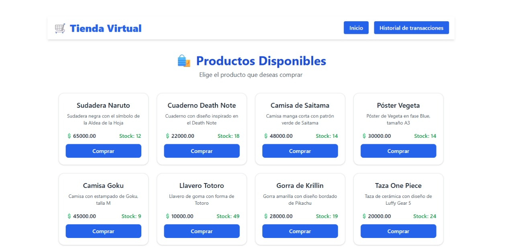
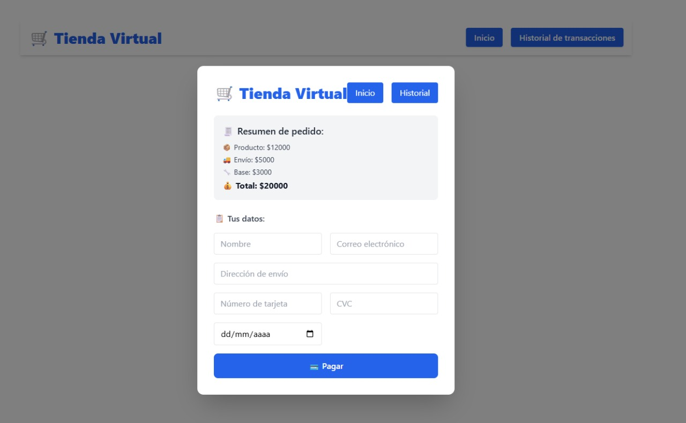
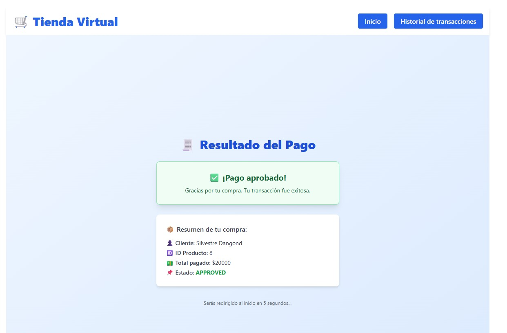
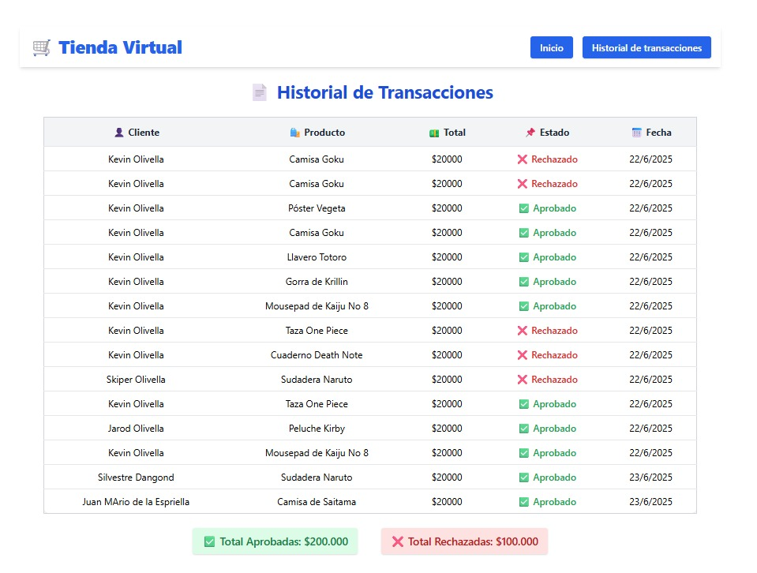
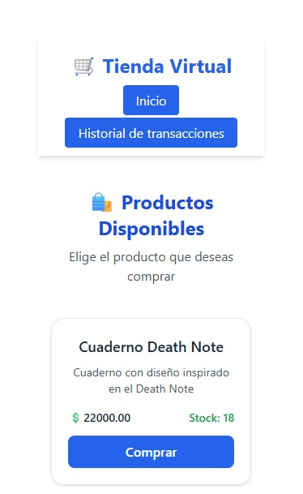
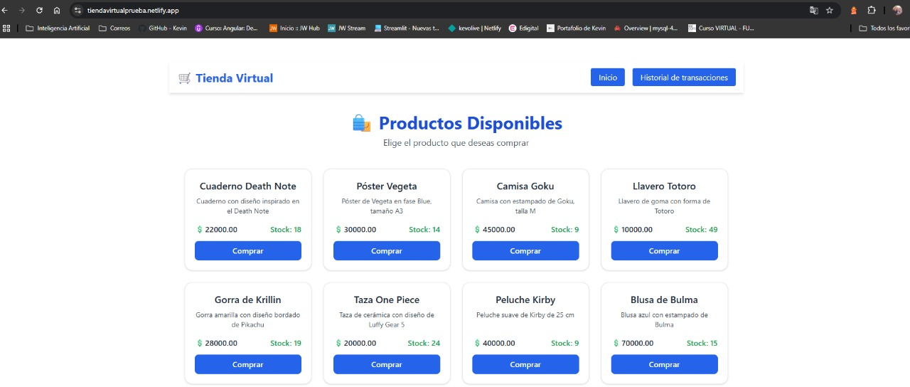

# 🛒 Tienda Virtual

Proyecto técnico fullstack de prueba con funcionalidades de productos, compra simulada, historial de transacciones y despliegue en la nube.

## ---------------------Descripción

Esta aplicación simula una tienda en línea donde el usuario puede:
- Ver una lista de productos.
- Simular una compra con formulario de pago.
- Ver resultados de la transacción.
- Consultar el historial de transacciones.
- Ver totales aprobados y rechazados.

## -----------------------Tecnologías utilizadas

**Frontend:**
- React + TypeScript
- Vite
- Tailwind CSS
- React Router DOM
- Axios
- React Modal

**Backend:**
- NestJS
- PostgreSQL
- TypeORM
- Render para despliegue

## URLs de despliegue

Frontend (Vercel): https://prueba-tienda-virtual.vercel.app/
Frontend (Netlify): https://tiendavirtualprueba.netlify.app/

Backend (Render): https://backend-wompi.onrender.com


  ##     Arquitectura del Backend

El backend sigue una estructura modular inspirada en la Arquitectura Hexagonal (Ports and Adapters):

Módulos por dominio: product, transaction

Controladores como puertos primarios

Servicios que encapsulan lógica de negocio

DTOs y entidades como adaptadores

Tests unitarios con Jest (*.spec.ts)

Esta organización permite:

Separación clara de responsabilidades

Mayor mantenibilidad

Escalabilidad y facilidad para testing

  ##  Mejoras UI/UX implementadas

Cards con sombra y diseño limpio para productos

Inputs con íconos y formularios estilizados

Feedback visual con íconos ✅ / ❌ en resultados de pago

Skeleton loaders y mensajes amigables

Diseño responsivo para dispositivos móviles

## Capturas de pantalla

### Página de Productos


---

### -------------------------Checkout / Compra


---

### ---------------------Resultado Aprobado


---

### ---------------------Historial de Transacciones


---

### --------------------Vista desde un móvil


---
### --------------------Despliegue en Netlify


---

Pruebas realizadas

- Se probaron transacciones con datos válidos e inválidos.
- Validación de formulario.
- Persistencia de datos en el backend.
- Redirección automática tras resultado de compra.

Ejecutar pruebas:

Backend
bash
Copiar
Editar
npm run test        # Ejecuta pruebas unitarias
npm run test:cov    # Genera cobertura

Frontend
bash
Copiar
Editar
npm run test
Cobertura actual (Backend):
sql
Copiar
Editar
File         | % Stmts | % Branch | % Funcs | % Lines
-------------|---------|----------|---------|---------
All files    |  21.39  |   0.57   |  17.64  |  22.9
 

                                                    ------Documentación de la API (Postman)---------

(https://web.postman.co/workspace/My-Workspace~cd984496-425e-4e1c-800d-35eb2278b02b/collection/39635729-d1a11389-42fc-47f8-98d5-5dc93efda327?action=share&creator=39635729&action_performed=google_login)

Endpoints disponibles
Método	Ruta	Descripción
GET	/products	Obtener todos los productos disponibles
POST	/products	Crear un nuevo producto
GET	/transactions	Obtener historial de transacciones
POST	/transactions	Crear una transacción simulada


##  Estructura del proyecto

/Backend
│ /src
│ /product
│ /transaction
│ .env.example
│ main.ts
│ app.module.ts
│ ...
/Frontend
│ /src
│ /components
│ /pages
│ App.tsx
│ main.tsx
│ ...
README.md


## Cómo ejecutar localmente

### ------------------1. Clona el repositorio

```bash
git clone https://github.com/tu-usuario/PruebaTiendaVirtual.git
cd PruebaTiendaVirtual


----------------------2. Backend
bash
Copiar
Editar
cd Backend
npm install
npm run start:dev
Asegúrate de tener PostgreSQL corriendo localmente o modificar el .env.

---------------------3. Frontend
bash
Copiar
Editar
cd ../Frontend
npm install
npm run dev
Abre tu navegador en http://localhost:5173.

---------------------Despliegue

Frontend: https://tutienda.netlify.app (Netlify/Vercel)

Backend: https://backend-wompi.onrender.com (Render)

👤 Autor
Kevin Olivella